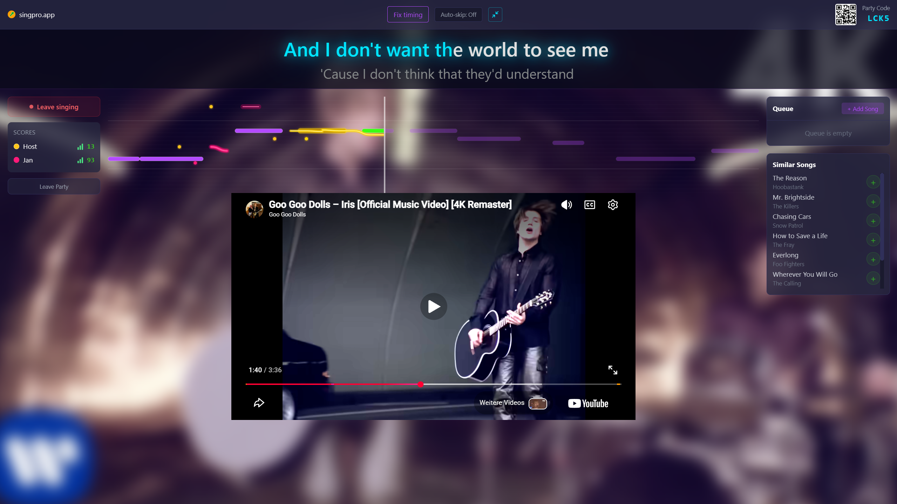

# singpro.app

Free online karaoke with friends. Pick a song, start a party, and sing together in real-time with pitch scoring.

**[singpro.app](https://singpro.app)**



## Features

- **20,000+ songs** with synced lyrics and pitch targets
- **Real-time multiplayer** -- host a party, share the code, sing together
- **Pitch scoring** -- client-side pitch detection (ONNX model via Web Audio API) with server-authoritative scoring
- **Live note visualization** -- see your pitch and other players' notes in real-time on a scrolling music bar
- **Song queue** -- drag-to-reorder queue so the party keeps going
- **Share cards** -- Spotify-Wrapped-style score cards you can share to social media
- **21 languages** -- full i18n with locale-prefixed URLs for SEO
- **Mobile-friendly** -- responsive layout with portrait and landscape support
- **Auto-skip** -- optionally skip intros, outros, and non-music sections
- **Gap correction** -- drag-to-fix timing offset for any song

## Tech Stack

- **React 19** with React Router 7
- **Tailwind CSS v4** -- dark neon theme, no component library
- **Vite 8** -- dev server, build, and HMR
- **Web Audio API** -- real-time pitch detection via AudioWorklet + ONNX Runtime (WASM)
- **WebSocket** -- live multiplayer sync (notes, scores, queue, player state)
- **i18next** -- 21 locales with browser language detection
- **Nginx** -- production serving with bot-aware SSR prerendering for SEO

## Getting Started

```bash
npm install
npm run dev
```

Dev server starts on [localhost:3001](http://localhost:3001), proxying API requests to the backend at `localhost:3000`.

## Scripts

| Command | Description |
| --- | --- |
| `npm run dev` | Start Vite dev server |
| `npm run build` | Production build to `build/` |
| `npm run preview` | Preview production build locally |
| `npm test` | Run tests (Vitest) |

## Docker

```bash
docker build -t singpro-fe .
docker run -p 80:80 singpro-fe
```

Multi-stage build: Node 24 Alpine for `npm ci && npm run build`, then Nginx Alpine to serve the static files.

## Project Structure

```
src/
  components/    UI components (MusicBars, Lyrics, ShareCard, ...)
  logic/         Pitch detection, mic input, lyrics parsing, WebSocket handling
  pages/         Route pages (Entry, Party, Join, compliance pages)
  i18n/locales/  21 locale JSON files
  index.css      Tailwind v4 theme (neon-cyan, neon-purple, neon-magenta, neon-green)
```

## License

MIT
