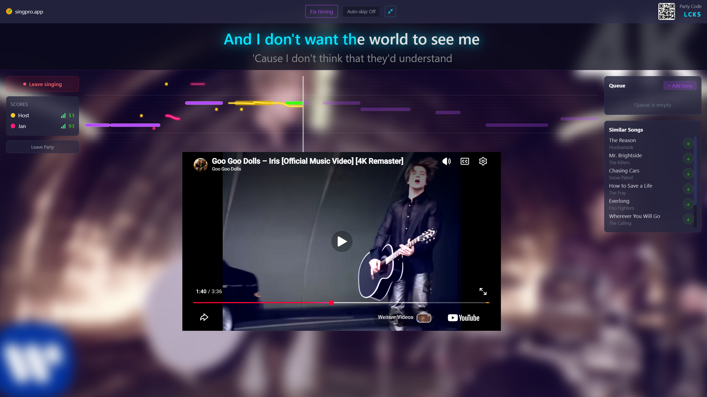

# singpro.app

Free online karaoke with friends. Pick a song, start a party, and sing together in real-time with pitch scoring.

**[singpro.app](https://singpro.app)**



## Features

- **20,000+ songs** with synced lyrics and pitch targets
- **Real-time multiplayer** -- host a party, share the code, sing together
- **Pitch scoring** -- client-side pitch detection (ONNX model via Web Audio API) with server-authoritative scoring
- **Live note visualization** -- see your pitch and other players' notes in real-time on a scrolling music bar
- **Song queue** -- drag-to-reorder queue so the party keeps going
- **Share cards** -- Spotify-Wrapped-style score cards you can share to social media
- **21 languages** -- full i18n; the language is a client-side preference, not part of the URL (one canonical URL per page)
- **Mobile-friendly** -- responsive layout with portrait and landscape support
- **Auto-skip** -- optionally skip intros, outros, and non-music sections
- **Gap correction** -- drag-to-fix timing offset for any song

## Tech Stack

- **React 19** with React Router 7
- **Tailwind CSS v4** -- dark neon theme, no component library
- **Vite 8** -- dev server, build, and HMR
- **Web Audio API** -- real-time pitch detection via AudioWorklet + ONNX Runtime (WASM)
- **WebSocket** -- live multiplayer sync (notes, scores, queue, player state)
- **i18next** -- 21 locales with browser language detection
- **Nginx** -- production serving; bots get prerendered HTML from the backend (`/prerendered` volume), legacy `/{lang}/…` and slug URLs get 301s

## Getting Started

Requires [Bun](https://bun.sh) >= 1.2.

```bash
bun install
bun run dev
```

Dev server starts on [localhost:3001](http://localhost:3001), proxying API requests to the backend at `localhost:3000`.

## Scripts

| Command | Description |
| --- | --- |
| `bun run dev` | Start Vite dev server |
| `bun run build` | Production build to `build/` |
| `bun run preview` | Preview production build locally |
| `bun run test` | Run tests (Vitest) |
| `bun run test:e2e` | Playwright end-to-end tests (needs the backend on :3000) |
| `bun run test:stress` | Many-singer stress test, see below |

### Stress test

`bun run test:stress` puts a dozen singers into one party: real Chrome contexts
with a fake microphone, each running the whole pipeline (AudioWorklet → ONNX
pitch worker → WebSocket), the first one hosting. Every browser carries an
in-page monitor, and the run ends with a per-client table (frame rate, long
tasks, JS heap, notes in/out, latency) plus assertions that nobody
disconnected, everyone is on the scoreboard, every singer's notes reached the
host and the host stayed above `MIN_FPS`.

| Env | Default | Meaning |
| --- | --- | --- |
| `REAL_SINGERS` | 12 | Chrome contexts (incl. the host) |
| `BOT_SINGERS` | 0 | extra synthetic singers driven from Bun over WebSocket (`e2e/wsSinger.js`), cheap enough for dozens |
| `STRESS_SECONDS` | 30 | how long everyone sings |
| `MIN_FPS` | 20 | host frame-rate threshold |
| `CPU_THROTTLE` | 1 | DevTools-style CPU slowdown for every real browser: 4 ≈ mid-range phone, 6 ≈ an old low-end one |

Serve the production build for realistic numbers (`bun run build && bunx vite preview`;
the test reuses whatever is on :3001), because React's development runtime
alone dominates a profile. Emulating an old phone with a dozen singers:
`REAL_SINGERS=1 BOT_SINGERS=11 CPU_THROTTLE=6 bun run test:stress`.

Mind what you are measuring: every real context runs its own ONNX pitch
worker and YouTube player, so a dozen of them on one laptop saturate the CPU
and every client (host included) stalls — the run then prints a warning that
the host video stopped advancing. That measures the machine, not the app. To
measure the frontend's cost of *rendering* many singers, keep the real
browsers few and add bots: `REAL_SINGERS=2 BOT_SINGERS=40 bun run test:stress`.

## Docker

```bash
docker build -t singpro-fe .
docker run -p 80:80 singpro-fe
```

Multi-stage build: Bun 1 Alpine for `bun install --frozen-lockfile && bun run build`, then Nginx Alpine to serve the static files. The build stage is deliberately not cached in CI -- installing takes about eight seconds, and caching it meant pulling a 577 MB `node_modules` layer out of the GitHub Actions cache first.

## Project Structure

```
src/
  components/    UI components (MusicBars, Lyrics, ShareCard, ...)
  logic/         Pitch detection, mic input, lyrics parsing, WebSocket handling
  pages/         Route pages (Entry, Party, Join, compliance pages)
  i18n/locales/  21 locale JSON files
  index.css      Tailwind v4 theme (neon-cyan, neon-purple, neon-magenta, neon-green)
```

## License

MIT
